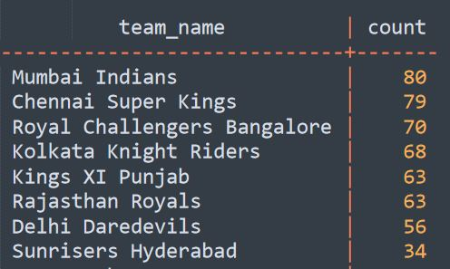
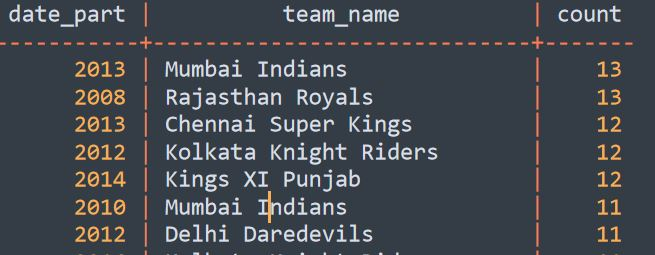
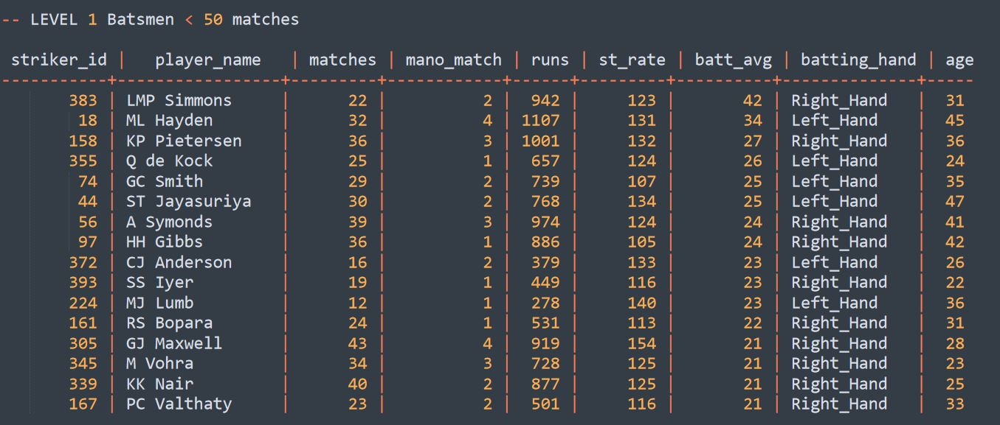
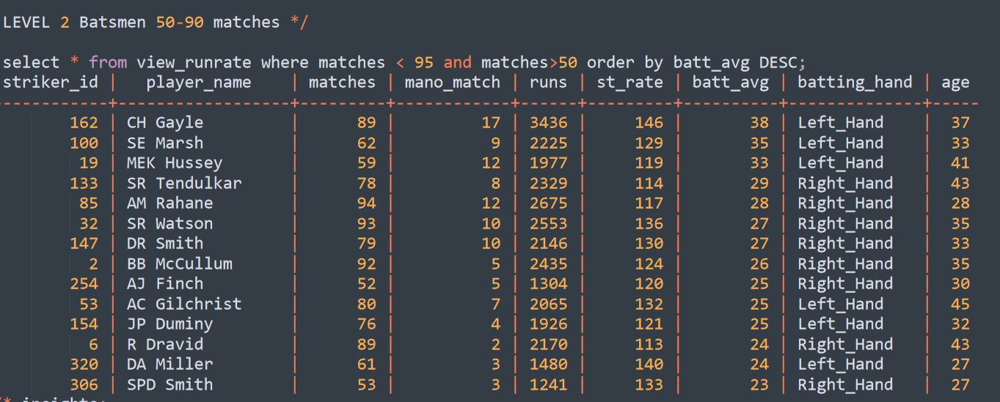
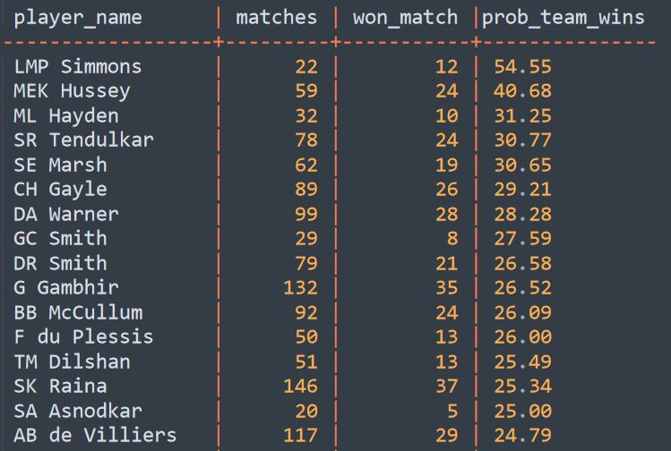
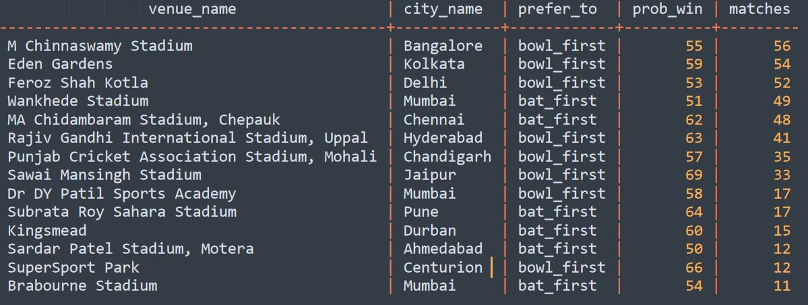

# IPL data analysis 2008-2016

Source of dataset: [Indian Premier League csv dataset by HarshaVardhan](https://www.kaggle.com/harsha547/indian-premier-league-csv-dataset?select=Match.csv

To get an overview of the data refer to the file titled IPL Data analysis.
To get the script to create the tables in SQL refer to the file 1) Create tables.

The analysis was done using Postgresql database management system.

Key insights sought during analysis:

### 1)Team with most wins over entire time frame and per season:

   
  ( Top 5 )
  Per season:
  
 

### 2)Common attributes of top run scorers such as age, batting style, experience :
  (a) Top run scorers are 5 years older on average.
  (b) 40 % more likely to be left handed batsman than on average.
  (c) Has played 20-25 more matches than the average player.
   
### 3)Most valuable batsmen based on correlation of their runs and team victory.

### Comprehensive batting statistics according to their experience.

LEVEL 1 batsmen with less than 50 matches under their belt.

LEVEL 2 with 50-90 matches

   

### % of matches where player has scored above 30 and team has won the match.

### 4)Toss decision based on venues. 

 

There are 6 tables in the dataset as shown at the bottom here, and namely,
1. Ball by ball
2. Match
3. Player_match
4. Player
5. Team
6. Season

